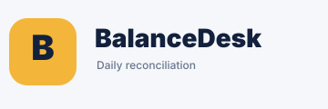
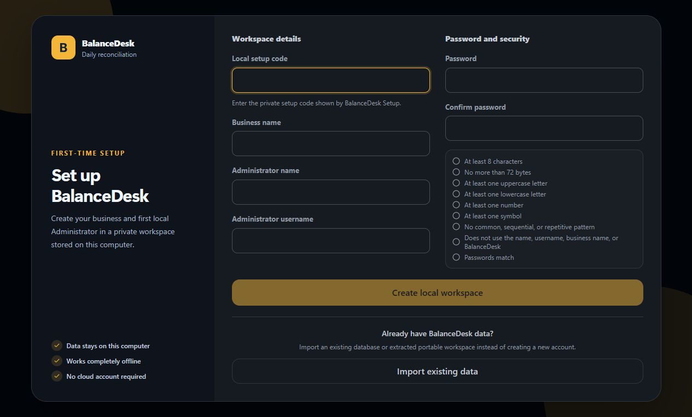
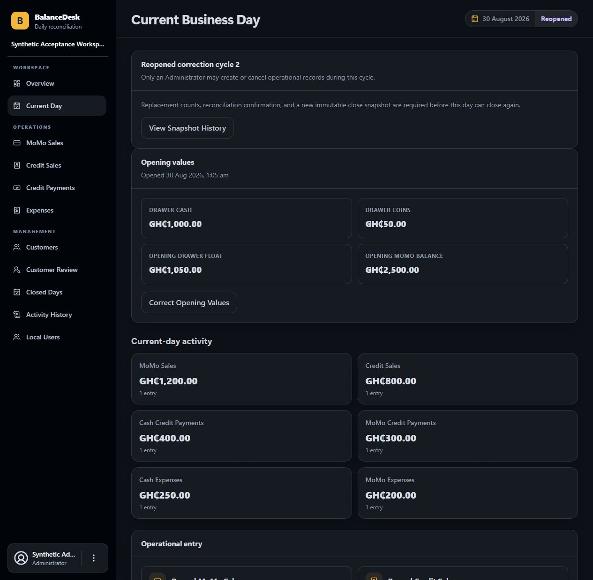
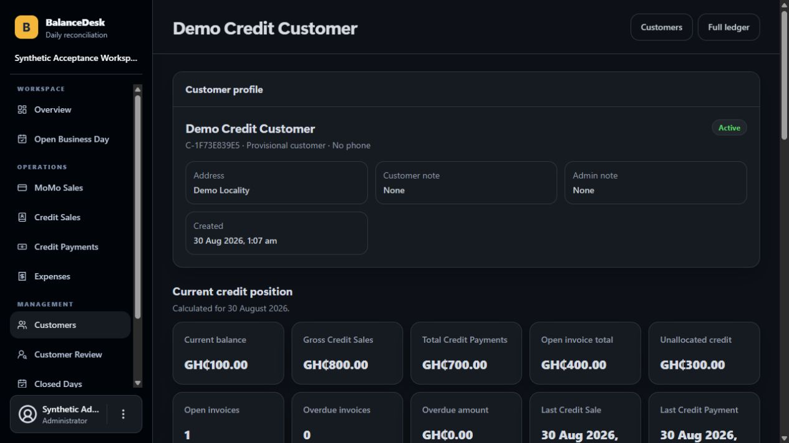
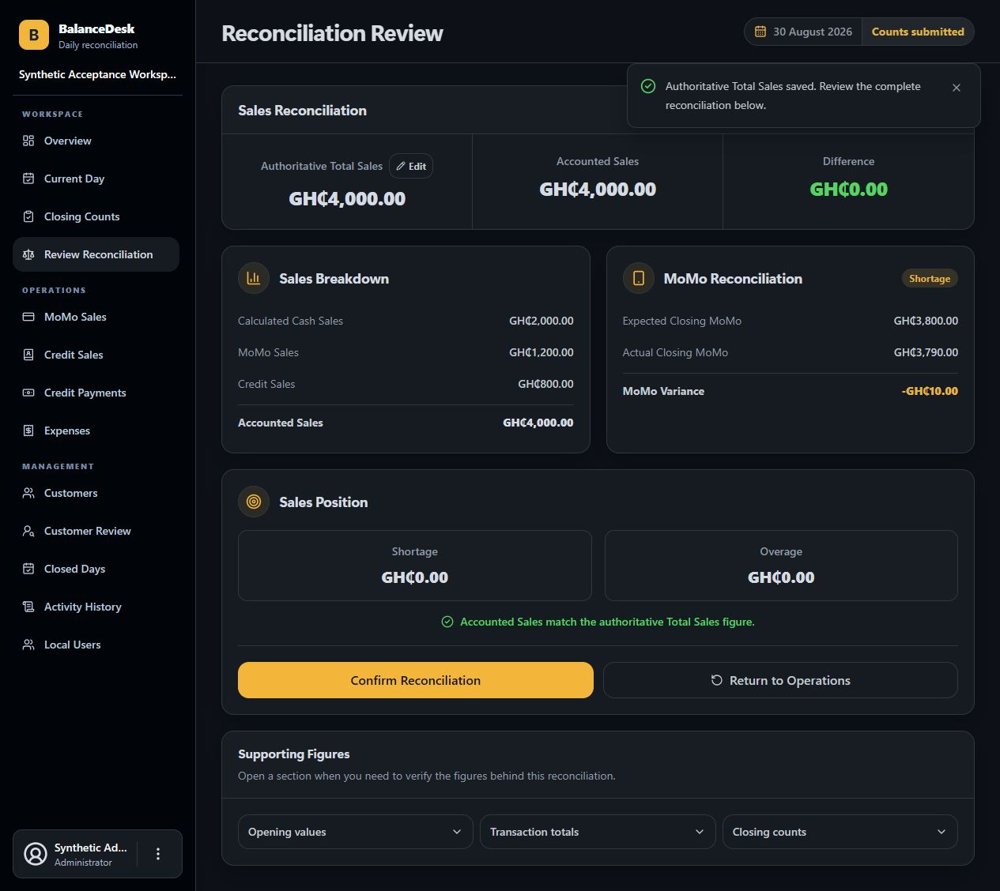
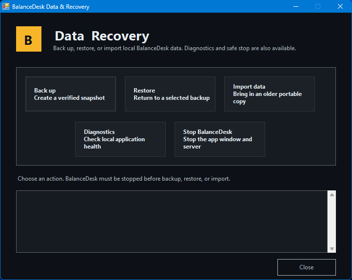

# BalanceDesk



BalanceDesk is a local-first, offline desktop application for recording daily sales, credit activity, expenses, physical closing counts, reconciliation, and final Business Day closure.

The current v1.2.0 release supports Windows x64 and x86-64 Linux. It includes its own private runtime and keeps the application, local accounts, audit history, backups, and SQLite database on the user's computer. It does not require a hosted service or cloud database.

## Product preview

These screenshots were captured from BalanceDesk v1.2.0. All names, accounts, dates, and financial figures shown are fictional demonstration data.

### First-time local workspace setup



### Daily operations and controlled corrections



### Customer credit position



### Reconciliation review



### Windows data and recovery tools



## Download BalanceDesk v1.2.0

Download the application from the [BalanceDesk v1.2.0 release](https://github.com/Ritchalison/BalanceDesk/releases/tag/v1.2.0).

Choose the files for your computer:

- **Windows installer — recommended:** `BalanceDesk-Setup-v1.2.0-windows-x64.exe` and `BalanceDesk-Setup-v1.2.0-windows-x64.exe.sha256`
- **Windows portable:** `BalanceDesk-v1.2.0-client-windows-x64.zip` and `BalanceDesk-v1.2.0-client-windows-x64.sha256`
- **Linux portable:** `BalanceDesk-v1.2.0-client-linux-x64.tar.gz` and `BalanceDesk-v1.2.0-client-linux-x64.tar.gz.sha256`

GitHub also adds automatic **Source code (zip)** and **Source code (tar.gz)** links to every release. Those automatic archives contain only this public documentation repository; they are not the BalanceDesk application. Always download one of the explicitly named BalanceDesk files above.

The public Linux release is the `.tar.gz` file. A Linux ZIP is not part of the release. A macOS package is not yet available.

## What BalanceDesk does

- Opens, reviews, reconciles, and closes one Business Day at a time.
- Records MoMo Sales, Credit Sales, Credit Payments, and Cash or MoMo Expenses.
- Tracks credit customers, invoices, payment allocations, balances, classifications, and possible duplicates.
- Captures physical closing Cash and actual closing MoMo balances.
- Calculates Cash Sales, Expected Closing MoMo, MoMo Variance, Accounted Sales, Overage, and Shortage.
- Preserves cancellation, correction, reopening, allocation-reversal, closing-snapshot, and actor history.
- Provides distinct Standard-user and Administrator workflows.
- Includes verified backup, confirmed restore, guarded existing-data import, diagnostics, and safe-stop tools.
- Runs entirely on the local computer and binds only to `127.0.0.1`.

Individual Cash Sale entry, inventory, payroll, tax accounting, bank or MoMo-provider integration, multi-branch networking, cloud sync, and hosted access are not part of the current release.

## Quick start

### Windows installer — recommended

1. Download the Windows Setup executable and its checksum file.
2. Verify the checksum using the instructions in [Installation and data safety](docs/INSTALLATION.md#verify-the-download).
3. Open `BalanceDesk-Setup-v1.2.0-windows-x64.exe`. The installer works for the current Windows account and does not require Administrator rights.
4. Choose either a new workspace or a trusted existing BalanceDesk `.db` file or extracted portable folder.
5. Choose whether to create a desktop shortcut, install BalanceDesk, and then select **Open BalanceDesk**.

On a fresh workspace, enter the private setup code shown by BalanceDesk when creating the first Administrator. An imported workspace opens at login and uses the accounts and passwords already stored in that workspace.

The v1.2.0 executable is not code-signed, so Windows may display an unknown-publisher or SmartScreen warning. Verify the supplied SHA-256 checksum before running a transferred installer.

### Windows portable

1. Download the Windows portable ZIP and its checksum file.
2. Verify the checksum and extract the entire ZIP to a normal local folder.
3. Open `BalanceDesk.exe` from the extracted folder.

Do not run BalanceDesk from inside the ZIP, a network share, OneDrive, Dropbox, or another synchronised folder.

### Linux portable

The Linux package requires x86-64 Linux with glibc 2.28 or newer and OpenSSL 3 (`libssl.so.3`). It does not support ARM, Alpine/musl, or systems that provide only an older OpenSSL library.

```bash
sha256sum -c BalanceDesk-v1.2.0-client-linux-x64.tar.gz.sha256
tar -xzf BalanceDesk-v1.2.0-client-linux-x64.tar.gz
cd BalanceDesk-v1.2.0-client-linux-x64
./Setup\ BalanceDesk.sh
```

Setup creates BalanceDesk and Data & Recovery entries for the current Linux user. It does not require root access or install a system service.

## Everyday use and data safety

On installed Windows, open BalanceDesk from the desktop or Windows Start. Closing the owned BalanceDesk app window safely stops its local server and signs out local sessions. Windows Start also provides **BalanceDesk Data & Recovery**, **BalanceDesk Diagnostics**, **Stop BalanceDesk**, and **Uninstall BalanceDesk**.

On Linux, open BalanceDesk from the application menu or the extracted folder. Closing an ordinary browser tab may not stop the private server, so use `Stop BalanceDesk.sh` or the Stop action in Data & Recovery when finished.

Always stop BalanceDesk before backup, restore, import, moving a portable folder, or updating it. Import replaces the complete active workspace; it is not a merge. The imported users, passwords, customers, transactions, and history become active, so make sure an Administrator login from that workspace is known first.

Installed Windows business data and backups remain separately under `%LOCALAPPDATA%\BalanceDesk`, including after uninstall. Windows portable and Linux portable data remain inside their extracted BalanceDesk folders. Keep verified backups on another protected local disk.

## Documentation

- [BalanceDesk v1.2.0 client guide (PDF)](docs/BalanceDesk-v1.2.0-Client-Guide.pdf)
- [BalanceDesk v1.2.0 release notes](docs/RELEASE_NOTES_v1.2.0.md)
- [Installation, import, backup, restore, diagnostics, and data safety](docs/INSTALLATION.md)
- [BalanceDesk v1.2.0 application flow and calculation guide](docs/BALANCEDESK_V1.2.0_APPLICATION_FLOW.txt)
- [Public changelog](CHANGELOG.md)

## Local-only privacy model

BalanceDesk does not require a hosted database, cloud authentication, remote API, telemetry service, CDN, email, SMS, WhatsApp, or external storage. It is not made available to other devices on the local network.

The user remains responsible for protecting the computer account, keeping verified backups, and avoiding public disclosure of business data, setup codes, passwords, diagnostics, or database files.

## About this repository

This repository is intentionally the public face of BalanceDesk. It contains public documentation, release guidance, and approved brand material—not the private development source tree or internal project records.

Packaged applications and checksum files are published as GitHub Release assets and are not committed into this repository.

## License

BalanceDesk is proprietary software and is not open source. See [LICENSE.md](LICENSE.md) for permitted use and restrictions.
